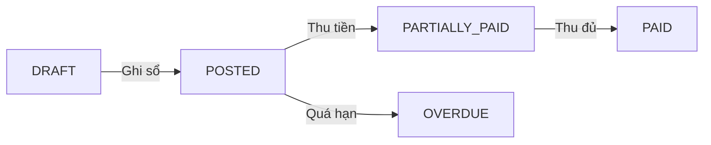

# 📋 PHASE 4: PRODUCTION READY - AR/AP, REPORTS & INFRASTRUCTURE

## Tổng Quan Phase 4

| Mục | Chi tiết |
|-----|----------|
| **Phiên bản** | 2.0 |
| **Thời gian** | 8 tuần (4 Sprints × 2 tuần) |
| **Tiền đề** | Phase 0, 1, 2, 3 hoàn thành |
| **Mục tiêu** | Production-ready ERP với AR/AP đầy đủ |

---

## 🎯 MỤC TIÊU PHASE 4

| # | Mục tiêu | Mô tả |
|---|----------|-------|
| 1 | **AR/AP Full Modules** | Invoice → Payment → Allocation → Aging |
| 2 | **Báo Cáo Tài Chính** | BCTC theo TT200, Trial Balance, General Ledger |
| 3 | **Auth & RBAC** | Production auth, phân quyền theo vai trò, multi-tenant |
| 4 | **Infrastructure** | Multi-region, RDS Global, CI/CD, Monitoring |
| 5 | **Testing & QA** | Unit, Integration, E2E, Performance, Security (>80%) |
| 6 | **UAT & Docs** | Parallel run, User Manual, API docs |

---

## 📊 TASK BREAKDOWN - 14 TASKS

### Sprint 4.1: AR Module (2 tuần)

| Task | Tên | Giờ | Mô tả |
|------|-----|-----|-------|
| **1** | Database Schema Phase 4 | 8-10h | AR/AP tables, Credit Memos, Failed Logins |
| **2** | AR Invoice CRUD | 10-12h | Create, Read, Update, Delete invoices |
| **3** | AR Invoice Posting | 8-10h | Ghi sổ GL, xuất kho tự động |
| **4** | AR Payments & Allocation | 10-12h | Phiếu thu, phân bổ vào HĐ |
| **5** | AR Aging Report | 6-8h | Báo cáo tuổi nợ phải thu |

### Sprint 4.2: AP Module & Reports (2 tuần)

| Task | Tên | Giờ | Mô tả |
|------|-----|-----|-------|
| **6** | AP Invoice & Payments | 12-14h | Hóa đơn mua, phiếu chi, allocation |
| **7** | Financial Report - Balance Sheet | 8-10h | Bảng CĐKT theo TT200 |
| **8** | Financial Report - P&L | 6-8h | Báo cáo KQKD |
| **9** | Trial Balance & General Ledger | 8-10h | Sổ cái, bảng cân đối phát sinh |

### Sprint 4.3: Auth & Infrastructure (2 tuần)

| Task | Tên | Giờ | Mô tả |
|------|-----|-----|-------|
| **10** | Production Auth System | 10-12h | Real auth, JWT refresh, brute force protection |
| **11** | RBAC & Multi-tenant | 8-10h | Permission middleware, tenant switcher |
| **12** | AWS Infrastructure | 16-20h | VPC, RDS, ECS, ALB, WAF |
| **13** | CI/CD & Monitoring | 10-12h | GitHub Actions, CloudWatch, PagerDuty |

### Sprint 4.4: Testing & UAT (2 tuần)

| Task | Tên | Giờ | Mô tả |
|------|-----|-----|-------|
| **14** | E2E Tests & UAT | 16-20h | Playwright, k6, OWASP, parallel run |

---

## 📦 TỔNG KẾT

| Sprint | Tasks | Giờ |
|--------|-------|-----|
| 4.1 - AR Module | 1-5 | 42-52h |
| 4.2 - AP & Reports | 6-9 | 34-42h |
| 4.3 - Auth & Infra | 10-13 | 44-54h |
| 4.4 - Testing | 14 | 16-20h |
| **TỔNG** | **14 Tasks** | **136-168h** |

---

## 🗄️ DATABASE SCHEMA PHASE 4

### New Tables

```
Schema: accounts_receivable
├── ar_invoices            (Hóa đơn bán hàng)
├── ar_invoice_lines       (Chi tiết hóa đơn)
├── ar_payments            (Phiếu thu)
├── ar_payment_allocations (Phân bổ thu)
└── ar_credit_memos        (Ghi chú giảm trừ)

Schema: accounts_payable
├── ap_invoices            (Hóa đơn mua hàng)
├── ap_invoice_lines       (Chi tiết)
├── ap_payments            (Phiếu chi)
├── ap_payment_allocations (Phân bổ chi)
└── ap_debit_memos         (Ghi chú tăng)

Schema: security
└── failed_logins          (Track login failures)
```

---

## 🔄 AR/AP WORKFLOW

### AR Invoice Flow



### Bút toán AR Invoice

```
Khi POST Invoice:
  Nợ TK 131 (Phải thu KH): 11.000.000
    Có TK 511 (Doanh thu): 10.000.000
    Có TK 33311 (VAT):     1.000.000

Khi thu tiền:
  Nợ TK 111/112 (Tiền): 11.000.000
    Có TK 131 (Phải thu): 11.000.000
```

### AP Invoice Flow

```
Khi POST APInvoice:
  Nợ TK 156 (Hàng hóa):    10.000.000
  Nợ TK 1331 (VAT vào):     1.000.000
    Có TK 331 (Phải trả): 11.000.000

Khi thanh toán:
  Nợ TK 331 (Phải trả): 11.000.000
    Có TK 111/112 (Tiền): 11.000.000
```

---

## 📈 TECH STACK

| Layer | Technology |
|-------|------------|
| Frontend | Next.js 14, TypeScript, React Query, Recharts, Shadcn/ui |
| Backend | Next.js Route Handlers, Prisma ORM |
| Database | PostgreSQL 16 RDS Global Cluster |
| Infrastructure | AWS (VPC, ALB, ECS/EKS, S3, CloudFront, WAF) |
| CI/CD | GitHub Actions |
| Monitoring | CloudWatch, Datadog, PagerDuty, Sentry |
| Testing | Jest, Playwright, k6, OWASP ZAP |

---

## ✅ DEFINITION OF DONE

### Per Task
- [ ] Unit test coverage >= 80%
- [ ] Integration test cho luồng 3+ bước
- [ ] Security scan không có HIGH/CRITICAL
- [ ] API < 500ms, UI < 2s, Reports < 5s

### Phase 4 Complete
- [ ] UAT với 3+ pilot customers
- [ ] Performance: 1,000 concurrent users
- [ ] Security audit pass (OWASP Top 10)
- [ ] Infrastructure: Multi-region, DR ready
- [ ] Documentation: User Manual, API docs, Videos

---

## 📁 TASK FILES

| File | Task |
|------|------|
| `Phase4_Task_01_Database_Schema.md` | Schema AR/AP |
| `Phase4_Task_02_AR_Invoice_CRUD.md` | AR Invoice Create/Read/Update/Delete |
| `Phase4_Task_03_AR_Invoice_Posting.md` | Ghi sổ GL, xuất kho |
| `Phase4_Task_04_AR_Payments_Allocation.md` | Phiếu thu, phân bổ |
| `Phase4_Task_05_AR_Aging_Report.md` | Báo cáo tuổi nợ |
| `Phase4_Task_06_AP_Module.md` | AP Invoice + Payments |
| `Phase4_Task_07_Balance_Sheet.md` | Bảng CĐKT |
| `Phase4_Task_08_Income_Statement.md` | Báo cáo KQKD |
| `Phase4_Task_09_Trial_Balance_GL.md` | Sổ cái, cân đối PS |
| `Phase4_Task_10_Production_Auth.md` | Auth system |
| `Phase4_Task_11_RBAC_MultiTenant.md` | Phân quyền |
| `Phase4_Task_12_AWS_Infrastructure.md` | VPC, RDS, ECS |
| `Phase4_Task_13_CICD_Monitoring.md` | GitHub Actions |
| `Phase4_Task_14_Testing_UAT.md` | E2E, Performance, UAT |

---

## 🎉 READY TO PROCEED!
